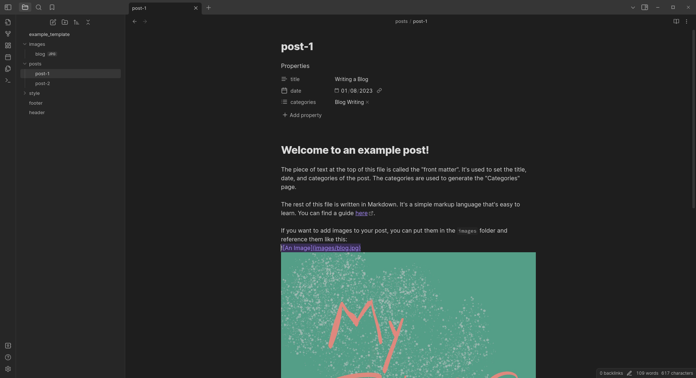

## Blog Builder 🖳

This is a simple static site generator for my blog, written in Rust.
The tool is accessible for everyone to use but it's been designed quite specifically for my needs and workflow.
Do get in touch if you happen to try it out!

I have used it to build my blog which you can find [here](https://james.poole.ie/notes).

### Project Goals 🥅
- To be able write content for my blog in markdown.
- To have my site generated as I would like, based on those markdown files.
- Support Categories.
- Support RSS.
- HTML and CSS only. No Javascript or other faff.

### Why? 🤔
- To create a system for building my website from the bottom up that I understand.
- To create something that perfectly fits my needs.
- For the fun of it.
- To try out Rust for creating a simple CLI tool.

### Platforms 🐧
- This tool has been built and tested only on Linux.

### Pre-requisites 🦀
- Install [Rust](https://www.rust-lang.org/tools/install). I use the `rustup` method that is described.

### Setup 🏗️

*method 1*
- Clone the repo.
- Run `cargo run -- --input example_template --output example_site` to generate the example site.
- A site will be generated in the `example_site` folder. If you open the `index.html` file in your browser, you should see the example site.
- When you run `cargo run`, a binary will be generated in the `target/debug` folder. You can optionally copy this out to somewhere else if you like for easier access. Instead of running `cargo run --` in the future, you can run the binary directly.

*method 2*

**Note:** This method does not include the example template. It is just the application binary. I recommend cloning the project to get the example template as a starting point.
- Download the binary from the releases.
- I place the binary in the same folder as my `input` and `output` folders for convenience.
- Make the binary executable with `chmod +x blog-builder`.
- Run `./blog-builder --input <input-folder> --output <output-folder>` to generate the example site.

### Usage 📖

**Note:** If you have downloaded the binary, replace `cargo run --` with `./blog-builder` in the following instructions.

- Run `cargo run -- --input <input> --output <output>` to generate your site.
- The `input` folder should follow the format of the `example_template` folder.
  - You can customise the contents of the templates how you would like!
- The `output` folder will be created if it doesn't exist.
- Running `cargo run -- --help` will show you the available options.

### How I write my blog posts 📝

A neat side effect of this tool and working with standards like markdown and front matter is that it is highly compatible with other tools.

An example that I stumbled across is using [Obsidian](https://obsidian.md/) to write my blog posts. I have set up an Obsidian Vault in my `input` folder. I can write my blog posts in Obsidian, easily add images and have them automatically added to the `images/` folder. The post metadata is also nicely presented as Properties at the top of the page! Then I can run this tool to convert the latest work and its ready to go!

### Future Plans
- Auto compress and dither images.
- Show a preview of each post whenever they are shown, instead of just the title.